# Neapolis - Project Work

**Tecnologie Software per il Web**  
**Università degli Studi di Salerno**  
**Canale A-H**  
**Anno accademico 2021-2022**

## Gruppo 04
| Nome | Matricola | Email |
|:----:|:---------:|:-----:|
| Alessandro Alfieri | 0612704766 | a.alfieri32@studenti.unisa.it |
| Vittorio Ciancio | 0612704825 | v.ciancio2@studenti.unisa.it |
| Ferdinando Cuomo | 0612704742 | f.cuomo35@studenti.unisa.it |
| Marco Di Maio | 0612704713 | m.dimaio39@studenti.unisa.it |

---

## Descrizione del progetto

"Neapolis" è un sito web dedicato alla presentazione delle attrazioni turistiche della città di Napoli.  
Il sito offre:
- Homepage con card descrittive delle attrazioni.
- Recensioni utente (solo per utenti registrati).
- Visualizzazione di posizione, tariffe e orari delle attrazioni.

### Limitazioni
- Non copre tutte le attrazioni della città.
- Commenti non modificabili né cancellabili dagli utenti.
- Username non modificabile dopo la registrazione.

---

## Architettura Tecnica

- **DBMS:** PostgreSQL
- **Database:** `TSW` (user: `www`, password: `tsw2022`)
- **Tabelle principali:**
  - `account` (utenti registrati)
  - `cristovelato`, `musarcheologico`, `napolisott`, `palazzo`, `sangennaro`, `santachiara` (recensioni attrazioni)

- **Tecnologie:**
  - PHP per la logica server-side.
  - JavaScript per validazioni lato client.
  - Sessioni e cookie per gestione autenticazione.

---

## Struttura delle pagine

- **Homepage:** Fotogallery + card attrazioni.
- **Accedi:** Form login con controlli JS e PHP.
- **Registrati:** Form registrazione, sicurezza password.
- **Account:** Visualizzazione dati utente.
- **Modifica Account:** Modifica dati e password.
- **Attrazione:** Informazioni + mappa + recensioni.
- **Scrivi Recensione:** Form con stelle e commento.

**Differenze di layout:** Header e Footer cambiano a seconda dello stato utente (anonimo/loggato).

---

## Dettagli implementativi

- **Sessioni:** Gestione attiva in tutte le pagine.
- **Cookie:** Creazione alla login, durata 6 ore.
- **Sicurezza:** Password crittografata tramite hash.
- **Controlli accessi:** Redirect e pop-up per utenti non loggati.
- **Protezione pagine:** Accesso controllato tramite sessioni.

**File principali:**
- `db.php`: Connessione al database.
- `login-manager.php`: Gestione login e cookie.
- `logout.php`: Logout e cancellazione cookie.
- `salva.php`: Salvataggio recensioni.

---

## Librerie esterne

- Google Fonts (tipografia del sito).

---

## Screenshot del sito

### Screenshot 1

### Screenshot 2

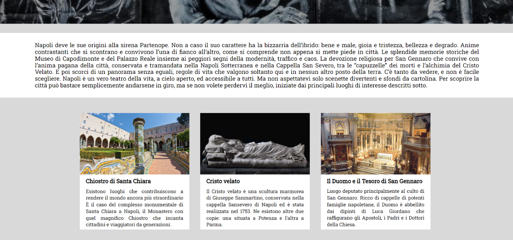

### Screenshot 3

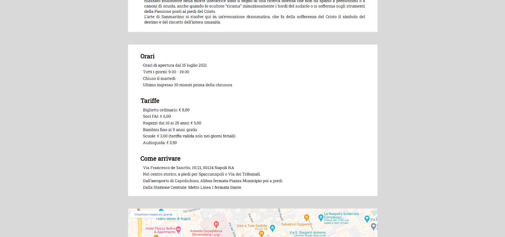

### Screenshot 4

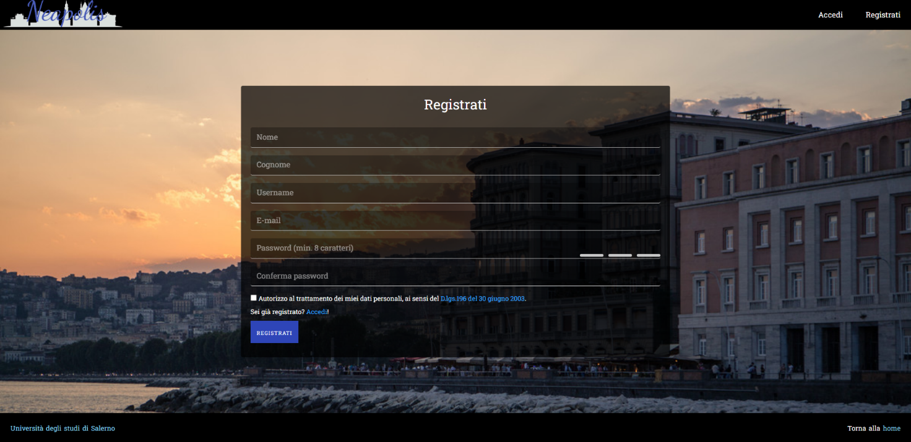

### Screenshot 5

### Screenshot 6

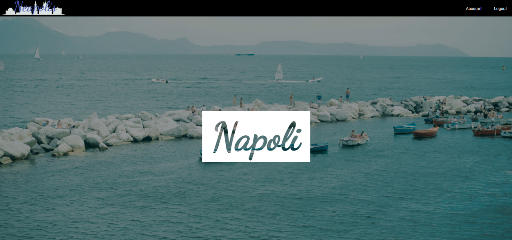

### Screenshot 7

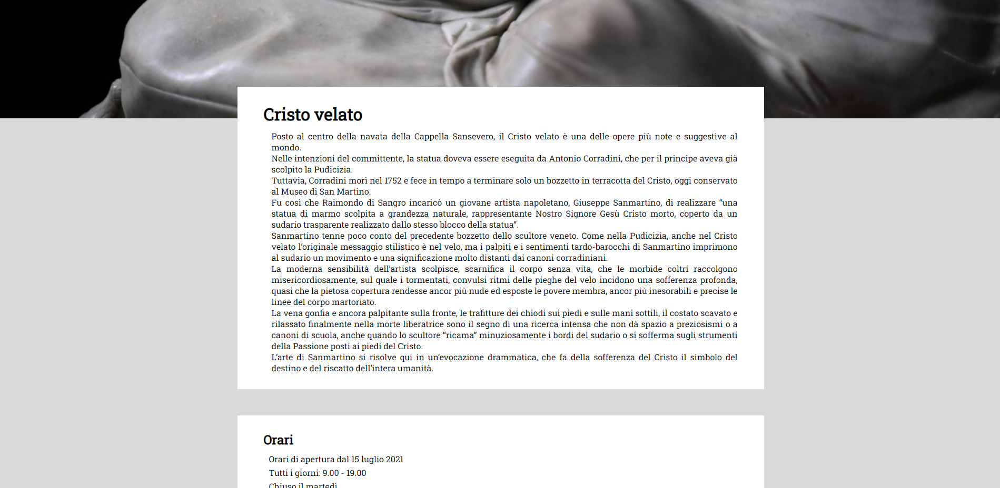

### Screenshot 8

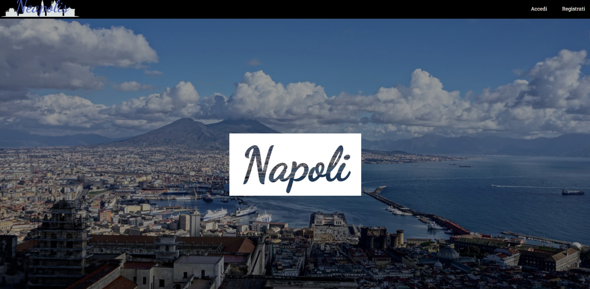

### Screenshot 9

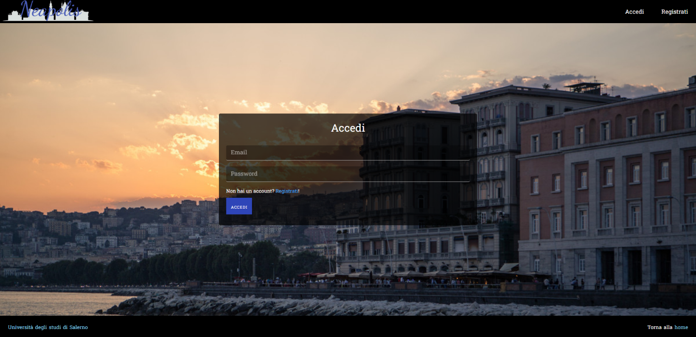

### Screenshot 10

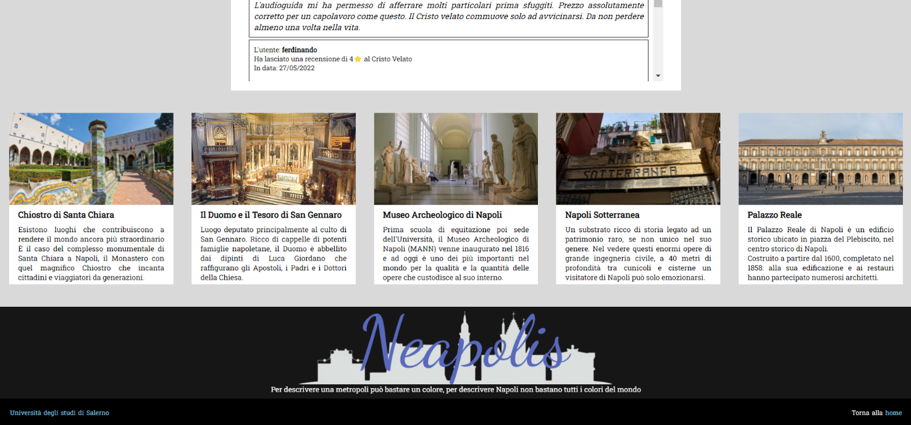

### Screenshot 11

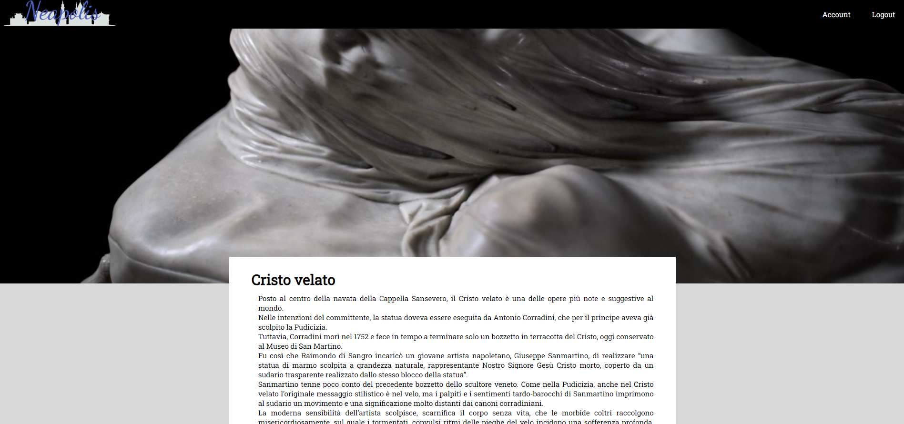

### Screenshot 12

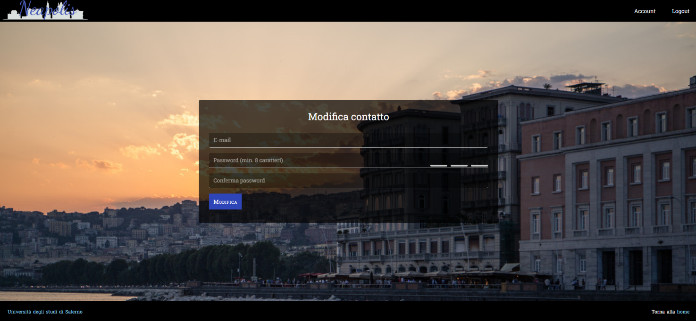

### Screenshot 13

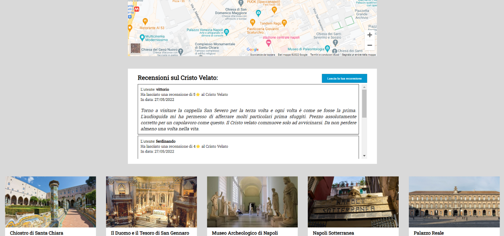

### Screenshot 14

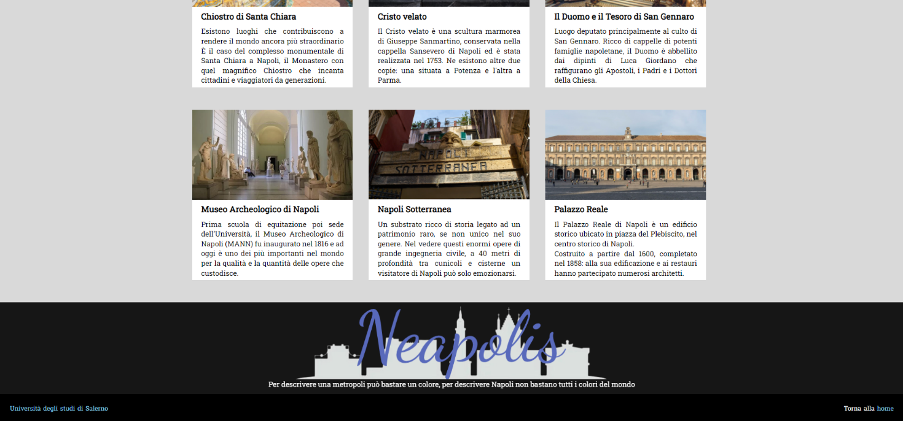

### Screenshot 15

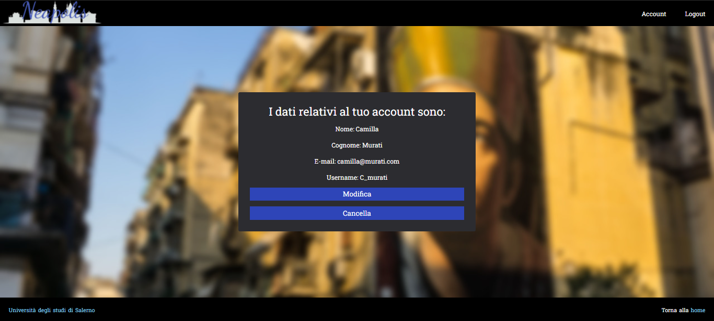

### Screenshot 16

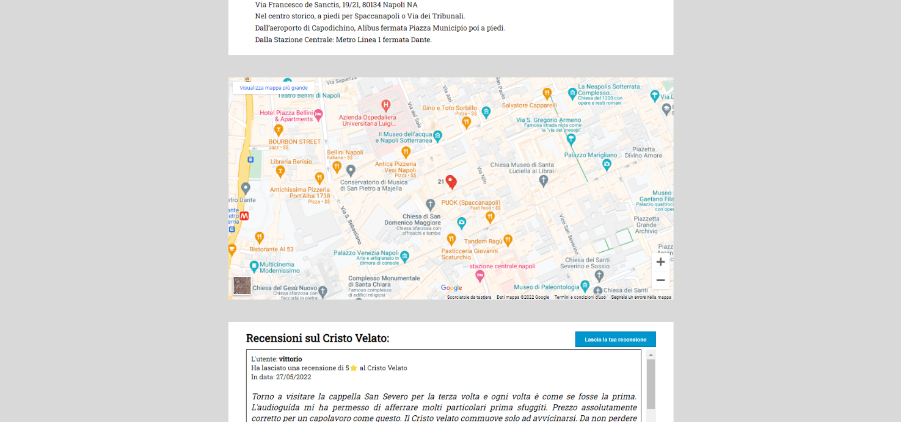

### Screenshot 17

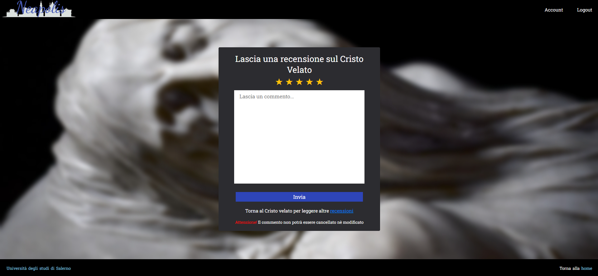